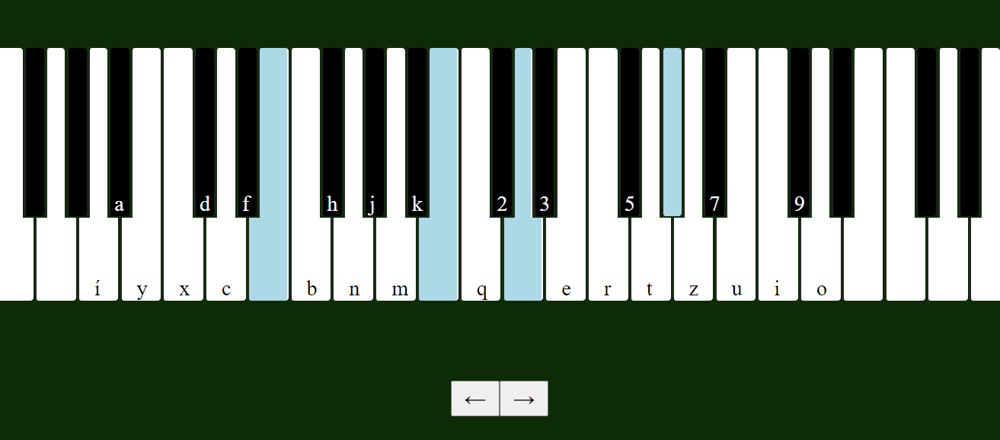

# pianokeys

Simple javascript keyboard piano using Tone.js v14.7.77
## References

- Tone js installation guide at: https://github.com/Tonejs/Tone.js
- XAMPP (free and open-source cross-platform web server solution stack package) : https://www.apachefriends.org/index.html
- inspiration and MP3 samples from: https://www.onlinepianist.com/virtual-piano

### NOTE:

- you have to find source path to Tone.js on your computer.
- the characters that indicate pressable notes may differ from the ones on your keyboard.

### TODO:

- make it more user friendly
- make changes in appearance
- make optional sound effects
- make a sustain
- make sheet music